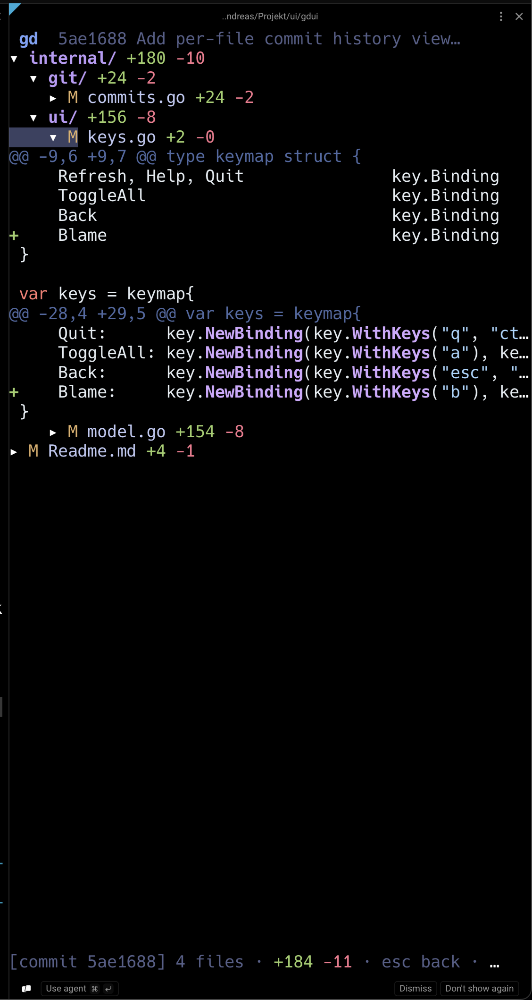

# gdui

A focused terminal UI for browsing your working-tree git diff as a sparse, collapsible file tree with inline syntax-highlighted diffs. Built to live in a narrow sidebar pane next to an agent like Claude Code, so you can see at a glance what's been changed without context-switching to a pager.



## Features

- **Sparse tree** — only changed paths appear; single-child directory chains are collapsed (`src/foo/bar/`).
- **Inline expansion** — press <kbd>enter</kbd> on a file to reveal the syntax-highlighted unified diff under the row, no pager handoff.
- **Multi-worktree split sidebar** — every linked git worktree of the same repo gets its own collapsible section in one pane, so feature-branch worktrees and the main checkout are side-by-side without juggling terminals.
- **Nested repos & submodules** — any independent git repo or submodule discovered under the working tree becomes its own section with its own branch, status, and watcher. Monorepo-style layouts with a frontend / backend split, or projects pulling in submodules, show up correctly without launching gdui separately in each.
- **Live updates** — fsnotify-backed file watcher refreshes the tree on disk changes (200 ms debounce), and refreshes the log view when a new commit lands. Useful when an agent is editing files or committing in another pane.
- **Three view modes** — cycle with <kbd>a</kbd> between *changed only*, *all tracked files*, and *commit log*; pick a commit to drill into its file tree.
- **Per-file history** — press <kbd>b</kbd> on any file to list every commit that touched it (renames followed via `git log --follow`); <kbd>enter</kbd> drills into a commit's diff.
- **Tree filter** — press <kbd>f</kbd> to narrow the tree by substring, glob (`*.go`), or full regex (`re:^cmd/`); applies across every linked worktree at once.
- **Drag-and-drop import** — drop files from Finder/Files/Explorer onto the window; a one-line prompt lets you pick the destination inside the repo, then copies atomically. Cursor lands on the new file once the tree reloads.
- **Full-text search** — press <kbd>/</kbd> to fuzzy-search file paths and contents across the repo; <kbd>enter</kbd> copies the result to the clipboard for hand-off to your editor or agent.
- **Keyboard + mouse** — vim-style navigation; click rows to toggle, scroll-wheel to scroll.
- **Status-aware markers** — `M` modified, `A` added, `D` deleted, `R` renamed, `?` untracked.
- **Single static binary** — shells out to the `git` CLI; no library needed.

## Built with

- [Bubble Tea](https://github.com/charmbracelet/bubbletea) — TUI runtime
- [Bubbles](https://github.com/charmbracelet/bubbles) — viewport component
- [Lip Gloss](https://github.com/charmbracelet/lipgloss) — styling
- [bubblezone](https://github.com/lrstanley/bubblezone) — mouse hit-testing for tree rows
- [Chroma](https://github.com/alecthomas/chroma) — syntax highlighting
- [fsnotify](https://github.com/fsnotify/fsnotify) — recursive file watching

## Install

### Homebrew (macOS, Linux)

```sh
brew install andreas-bergstrom/tap/gdui
```

macOS binaries are signed with my Developer ID and notarized — no Gatekeeper warning on first run.

### Pre-built binaries

The [latest release](https://github.com/andreas-bergstrom/gdui/releases/latest) ships archives + `checksums.txt` for:

- **macOS** arm64 / amd64 (`.tar.gz`) — signed with my Developer ID and notarized
- **Linux** arm64 / amd64 (`.tar.gz`)
- **Windows** amd64 (`.zip`)

**macOS / Linux:**

```sh
VERSION=0.1.0          # bump to whatever the releases page shows
OS=darwin              # or linux
ARCH=arm64             # or amd64

curl -LO "https://github.com/andreas-bergstrom/gdui/releases/download/v${VERSION}/gdui_${VERSION}_${OS}_${ARCH}.tar.gz"
tar -xzf "gdui_${VERSION}_${OS}_${ARCH}.tar.gz"
sudo install -m 0755 gdui /usr/local/bin/gdui
```

**Windows:** download `gdui_<version>_windows_amd64.zip` from the [releases page](https://github.com/andreas-bergstrom/gdui/releases/latest), extract `gdui.exe`, and place it on your `PATH` (e.g. `%LOCALAPPDATA%\Microsoft\WindowsApps\`).

Verify integrity (macOS / Linux):

```sh
shasum -a 256 -c checksums.txt
```

### From source

```sh
go install github.com/andreas-bergstrom/gdui@latest
```

Or clone and build:

```sh
git clone https://github.com/andreas-bergstrom/gdui.git
cd gdui
make install         # installs to ~/.local/bin/gdui
```

Requires Go 1.23+ and `git` on `PATH`.

## Usage

Run from anywhere inside a git repo:

```sh
gdui
```

The binary is named `gdui` rather than `gd` because `gd` is a common alias for `git diff`.

### Keys

| Key                          | Action                                |
|------------------------------|---------------------------------------|
| `j` / `↓`, `k` / `↑`         | move cursor                           |
| `enter` / `space`            | toggle expand/collapse (or open commit in log mode) |
| `h` / `←`                    | collapse (or jump to parent)          |
| `l` / `→`                    | expand                                |
| `[` / `]`                    | previous / next folder                |
| `g` / `G`                    | top / bottom                          |
| `ctrl+u` / `ctrl+d`          | page up / down                        |
| `a`                          | cycle view: changed → all → log       |
| `b`                          | file history (on a file row)          |
| `/`                          | open full-text search                 |
| `f`                          | filter tree (substring / glob / `re:` regex) |
| `tab` / `⇧tab`               | cycle active worktree (in log / file-history mode) |
| `esc` / `backspace`          | back out of a commit, or out of file history |
| `r`                          | refresh manually                      |
| `?`                          | toggle help                           |
| `q` / `ctrl+c`               | quit                                  |
| left-click row               | toggle expand/collapse                |
| scroll wheel                 | scroll viewport                       |

### View modes

Press <kbd>a</kbd> to cycle:

1. **Changed** *(default)* — sparse tree of files with working-tree changes vs `HEAD`.
2. **All** — every tracked file in the repo, with diff counts on changed ones.
3. **Log** — the last 100 commits on the current branch. Select one with <kbd>enter</kbd> to open its file tree (commit vs parent; root and merge commits handled). <kbd>esc</kbd> / <kbd>backspace</kbd> returns to the log.

From *changed* or *all*, press <kbd>b</kbd> on any file row to open a **file history** view — the commits that touched that file (renames followed via `git log --follow`). <kbd>enter</kbd> drills into a commit; <kbd>esc</kbd> returns to the file history, then again to the tree.

### Multi-worktree

If the repo has linked worktrees (`git worktree add …`), each one renders as its own collapsible section in the same pane, ordered by `git worktree list`. The launch directory's worktree is the initial *active* one — it determines which section the cursor opens on, and which worktree's data is shown in the log / commit / file-history modes. Use <kbd>tab</kbd> / <kbd>⇧tab</kbd> there to cycle the active worktree without leaving the mode.

The file watcher runs once per worktree, so a save in any of them refreshes only the affected section. The tree filter (<kbd>f</kbd>) applies across all sections simultaneously, so you can spot a file by name regardless of which worktree it lives in.

### Nested repos & submodules

Any independent git repository or submodule found beneath the launch worktree shows up as an additional section, alongside the parent and any of its linked worktrees. A monorepo with `parent/` and `parent/frontend/.git` lands as two sections; a project with submodules lands as the parent plus one section per submodule. Each nested section has its own branch, status, file watcher, and log view, and is labelled with its path relative to the parent so two repos on the same branch name stay distinguishable.

Discovery walks the working tree once at startup (skipping `.git`, `node_modules`, `vendor`); nested repos created during a session need a manual <kbd>r</kbd> to appear and a gdui restart to get their own watcher. Searching (<kbd>/</kbd>) is scoped to the active section, so a search in a nested repo only returns its own files.

### Filtering the tree

Press <kbd>f</kbd> in any tree view to open a one-line filter prompt at the bottom of the pane. The filter applies to **every worktree** simultaneously and matches against the **full repo-relative path**. Directories whose subtree contains a match are auto-revealed even if collapsed.

| Pattern            | Behavior                                                                  |
|--------------------|---------------------------------------------------------------------------|
| `status`           | Substring match. Smart-case: lowercase → case-insensitive.                |
| `STATUS`           | Any uppercase letter switches to case-sensitive matching.                 |
| `*.go`             | Glob — `*` matches within a path segment, `?` matches one non-slash char. |
| `**/foo.go`        | `**` crosses path separators.                                             |
| `[!a-z]*.md`       | POSIX-style glob negation.                                                |
| `re:^cmd/.*\.go`   | `re:` prefix → full Go regex (anchors and groups available).              |

<kbd>enter</kbd> commits the filter, <kbd>esc</kbd> clears it. Press <kbd>f</kbd> again to refine the existing query. The filter persists across mode cycling (<kbd>a</kbd>) and file-watcher refreshes; non-tree views just ignore it.

### Drag-and-drop import

Drag a file from your file manager onto the gdui window. A prompt appears at the bottom showing the source and a default destination (`<active-worktree>/<filename>`). Edit the destination with regular typing / <kbd>backspace</kbd> / <kbd>ctrl+u</kbd>, then <kbd>enter</kbd> to copy. If the destination already exists, you get a `(y/n)` confirmation — <kbd>y</kbd> / <kbd>Y</kbd> / <kbd>enter</kbd> overwrites, <kbd>n</kbd> / <kbd>N</kbd> / <kbd>esc</kbd> returns to editing the path. Multi-file drops queue up and prompt one at a time. <kbd>esc</kbd> on the destination prompt skips the current file and advances.

Copies are atomic (temp file in the destination directory + `os.Rename`) so the file watcher never surfaces a partial write. The cursor lands on the new file once the tree reloads.

**Terminal compatibility**: works in any terminal that enables bracketed paste — Terminal.app, iTerm2, kitty, alacritty, WezTerm, GNOME Terminal, Windows Terminal. Warp doesn't enable bracketed paste by default, so drops there work only for filenames without spaces; paths with spaces show a helpful error in the status row pointing you at a compatible terminal.

## What it shows

- Working tree compared against `HEAD` — staged changes, unstaged changes, and untracked files all in one view.
- Per-file `+N -M` line counts; folders show aggregate counts of their changed children.
- Renames are shown under the new path with `← old/path` annotation.
- Binary files render a `⟨binary file⟩` placeholder.
- Files larger than ~2000 changed lines render a truncation placeholder rather than blocking the UI.

## Development

```sh
go test ./...                              # all tests
go test ./internal/git/...                 # diff parser tests
go vet ./...
go build -o gdui .
```

The UI smoke test (`internal/ui/smoke_test.go`) auto-skips if `/tmp/gd-smoke` (or `$GD_SMOKE_REPO`) is not a git repo. To exercise it, populate that directory with a dirty repo first.

See `CLAUDE.md` for the architecture overview and release pipeline.
